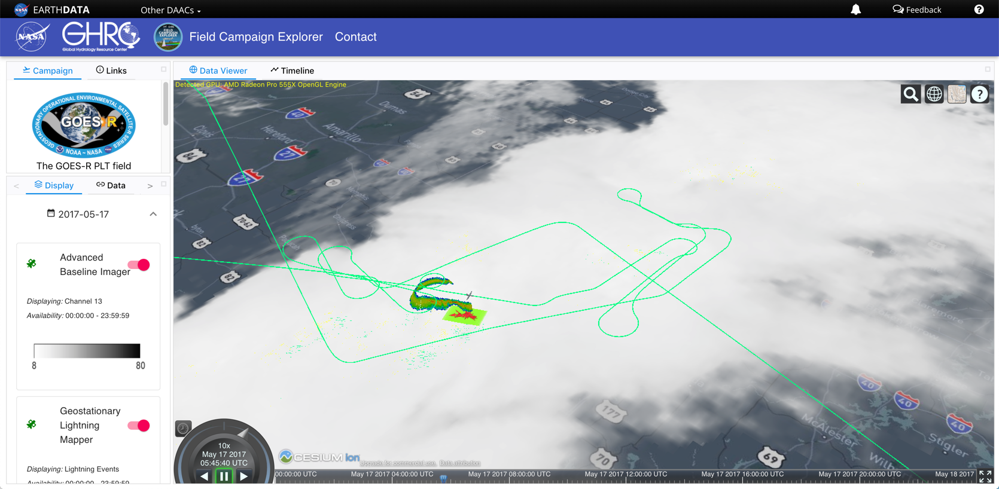

# Field Campaign Explorer Frontend Interface

This repository contains code for GHRC's Field Campaign Explorer (FCX) GUI (frontend).



## Installation Prerequisites

- Install Node (>= v12.6.0) https://nodejs.org/en/download/package-manager/
- Install Yarn https://classic.yarnpkg.com/en/docs/cli/install/
- Install AWS CLI https://docs.aws.amazon.com/cli/latest/userguide/install-cliv2.html

 Setup the env variables based on `src/config.js` 
 Note: The Access tokens and base URL locations must be specified for the application to work.


## Running

To run, execute following commands

```console
$ git clone <repo_link>
$ cd <repo_name>
$ yarn
$ yarn start
```

And navigate browser to http://localhost:3000/

## Deployment

To deploy, make sure correct values are entered in `config.js` file or set as environmental variables and then execute following commands

```console
$ yarn build
$ aws s3 sync build/ s3://<bucket-name>/
```

This build is currently configured to run from a sub directory called `fcx` which is specified in `index.html` as `base` tag and in `package.json` as `homepage` attribute.

This was done so that FCX can be deployed as `https://ghrc.earthdata.nasa.gov/fcx` which points to a subdirectory on S3.

To test this, move the contents of build directory to a subdirectory called `/build/fcx` and run following command

```console
$ cd build
$ python3 -m http.server
```

And then goto to `http://localhost:8000/fcx/`

## Notes

- Additional [Documentation](docs/documentation.md) is available in `docs/documentation.md`

- This repository uses a package maintained by `Brian Ellingson` https://www.npmjs.com/package/temporal-3d-tile

- The layers that are currently shown are encoded in `layers.js` file. In future, we need to dynamically change values in this file or create a way to manage a separate layer file for each field campaign.

- Currently, the compiler is throwing erro 'Critical dependency: require function is used in a way in which dependencies cannot be statically extracted' for './node_modules/cesium/Source/Core/buildModuleUrl.js' file. Pleas see for https://github.com/CesiumGS/cesium/issues/8401 for further reference. How to resolve this error is still pending.

- Initial code developed by Ajinkya Kulkarni