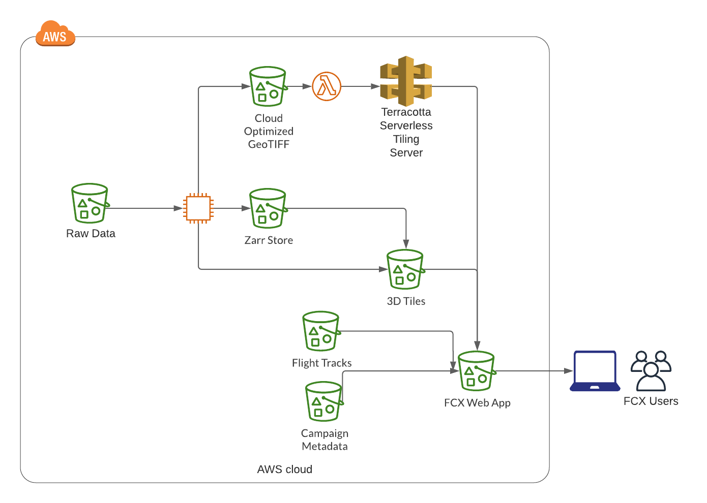
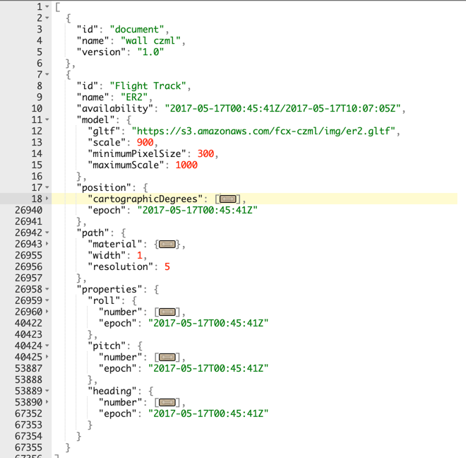
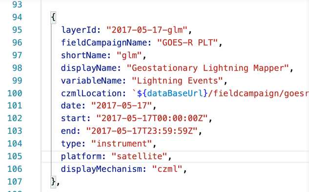
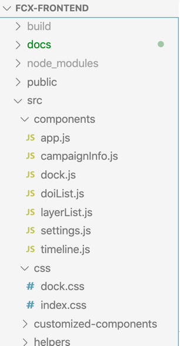
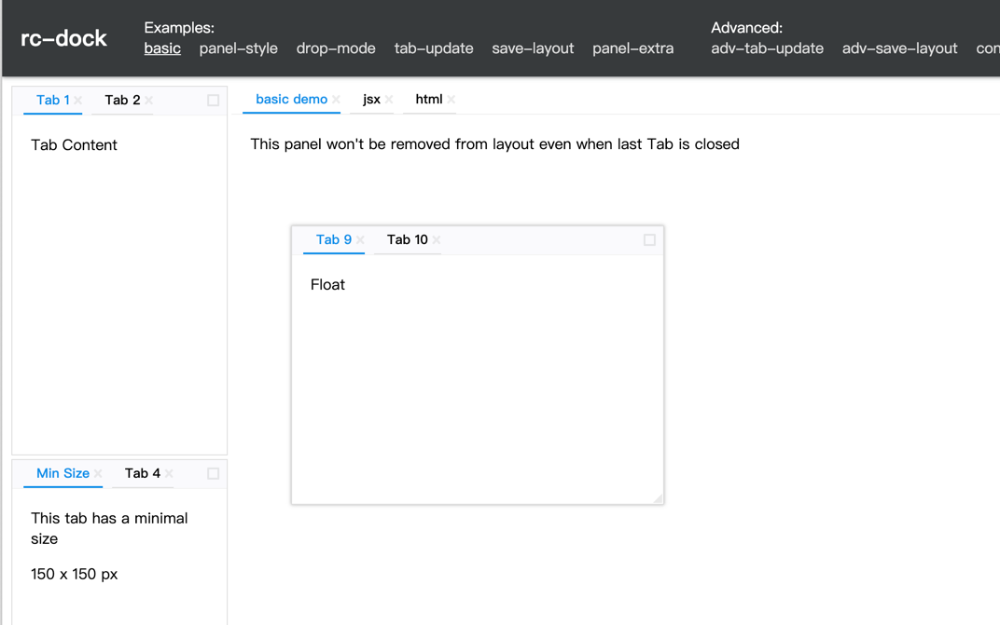
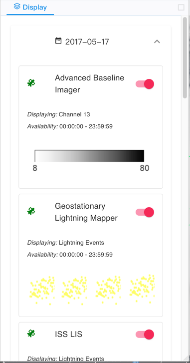

# FCX Frontend Documentation

This document contains the information how the front end of FCX works.

## Background

A key component of NASA’s Earth Observing System is its field experiments, for intensive observation of particular phenomena such as hurricanes, or for ground validation of satellite observations. These field experiments collect many datasets from a wide variety of satellite, airborne, and ground-based instruments, on different spatial and temporal scales, often in unique formats. Such diverse environmental observations are important for physical process studies, disaster assessment and response, as well as for the validation of environmental satellite observations and atmospheric models which can improve forecasts. However, the challenges inherent in working with such diverse datasets mean they are underused despite their value.

The Field Campaign eXplorer (FCX) addresses challenges inherent with utilizing these datasets to improve data management and discoverability to enable scientists to rapidly collect, visualize, and analyze these data. FCX was originally developed for the Hurricane and Severe Storm Sentinel (HS3) field campaign that investigated hurricane intensification. More recently, the Global Hydrology Resource Center DAAC has leveraged work from Visualization for Integrated Satellite, Airborne and Ground-based data Exploration (VISAGE) project. FCX has incorporated the lessons learned from VISAGE to transition FCX into a robust, cloud-native tool for exploring, visualizing, and analyzing diverse data in a common framework.

## Architecture

Following is the architecture of FCX as of August 2020

- The raw data collected from field campaigns is stored in a S3 bucket. A data reader is written for each dataset that is being made available in the FCX application. Data readers are mostly written in Python and are stored in the separate FCX backend source code repository.

- Data readers convert the raw data either into following format

  - Zarr (https://zarr.readthedocs.io/en/stable/)
  - 3D Tiles (https://github.com/CesiumGS/3d-tiles)
  - COG (https://www.cogeo.org/)

- Primary display on Cesium is achived using

  - 3D Point Cloud (https://cesium.com/3d-tiling-pipeline/point-clouds/)
  - CZML (https://github.com/AnalyticalGraphicsInc/czml-writer/wiki/CZML-Guide)
  - WebMapTileServiceImageryProvider (https://cesium.com/docs/cesiumjs-ref-doc/WebMapTileServiceImageryProvider.html)

- Background imagery is stored as COG and served using Terracotta serverless tiling server (https://terracotta-python.readthedocs.io/en/latest/)

- Flight tracks are stored as CZML. An example CZML can be viewed here https://fcx-czml.s3.amazonaws.com/flight_track/goesrplt_naver2_IWG1_20170517-1010

- Campaign metadata is stored in JSON format. Example metadata for GOES-R PLT Field Campaign is included in this file: [layers.js](../src/layers.js)

  

- FCX app is developed using `Create React App` template (https://reactjs.org/docs/create-a-new-react-app.html) and built files are stored in a S3 bucket.

- Once all the `3D Tiles`, `COG`, `CZML` and `React build` are stored in S3, the entire application works serverlessly

## Code Organization

React components are stored in `src/components` folder. Helper files are stored in `src/helpers` folder.

Following are the two mechanisms that are used to communicate between components:

- Redux Store using `redux` module
- Events using `eventemitter3` module (https://github.com/primus/eventemitter3)

Redux store related files are stored in `src/state` folder. The logic to change state of selected layers is stored in `src/state/reducers/listReducer.js` file.

The customized timeline component (https://github.com/BHP-DevHub/react-timeline-9000) is stored in in `src/customized-components` folder.

Configuration are stored in `src/config.js` file.

`index.html` file is stored in the `public` folder

## Working

The application's layout is managed as dockable panels using `rc-dock` (https://ticlo.github.io/rc-dock/examples/). The code for this is `src/components/dock.js` file

The code to construct layers list is in `src/components/layerList.js` file

`src/components/app.js` defines the `App` component which is the root component. The `app.js` file has code render layers on Cesium, manage camera state and react to events. The time dynamic point cloud animation are made possible using `Temporal3DTileset` class provided by `temporal-3d-tile` (https://www.npmjs.com/package/temporal-3d-tile)
